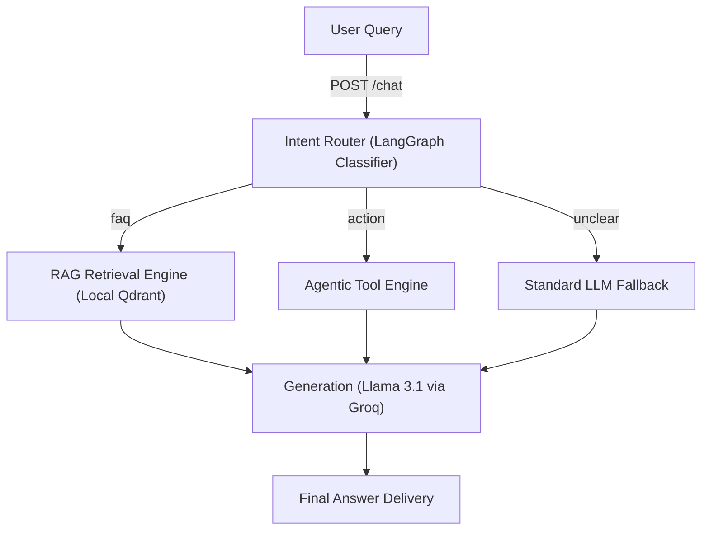

# AI Agentic Support System

An enterprise-ready AI chatbot architecture engineered for customer support and educational platform assistance. The system combines deterministic graph-based routing with Retrieval-Augmented Generation (RAG) and dynamic tool-calling to resolve complex multi-step user inquiries.

Designed for high performance and data privacy, the backend operates entirely independent of OpenAI. It utilizes on-device HuggingFace embedding models, local vector storage, and Groq's lightning-fast Llama 3.1 inference engine.

---

## 🚀 Core Capabilities

- **Graph-Based Orchestration (LangGraph):** Employs explicit conditional routing to classify intents. Requests are deterministically directed to a knowledge-retrieval pipeline, an agentic tool executor, or a predefined fallback handler.
- **Local RAG Pipeline (Qdrant + HuggingFace):** Ingests and retrieves knowledge bases locally. Bypasses cloud latency and connection drops by using the `all-MiniLM-L6-v2` model for text embeddings and storing vector data directly to disk (`qdrant_data/`).
- **Dynamic File Ingestion:** Features native PDF parsing. Uploaded documents are automatically buffered, extracted via `pypdf`, dynamically chunked, embedded, and mapped to the local Qdrant space.
- **LLM Tool Execution:** Natively supports multi-tool selection, enabling the LLM to trigger backend APIs (such as checking schedules or creating support tickets) before summarizing an answer.
- **High-Concurrency API (FastAPI):** Deploys as a lightweight, asynchronous API server, ready to be consumed by modern React, Vue, or Next.js frontends.

---

## 🏗 Architecture



---

## 📋 Installation

### 1. Environment Setup
Configure your virtual environment and install the required dependencies:
```bash
# Initialize virtual environment
python -m venv .venv

# Activate on Windows:
.venv\Scripts\activate
# Activate on MacOS/Linux:
source .venv/bin/activate

# Install dependencies
pip install -r requirements.txt
```

### 2. Configuration
Copy the environment template. You will need a valid [Groq API Key](https://console.groq.com/) to power the inference engine.
```bash
cp .env.example .env
```
Ensure your `.env` variables contain the following fundamentals:
```env
# Core Configuration
LLM_PROVIDER="groq"
MODEL_NAME="llama-3.1-8b-instant"
GROQ_API_KEY="your-api-key-here"

# Vector Database
COLLECTION_NAME="support_docs_v2"
```

---

## ⚙️ Execution & Deployment

Start the asynchronous API server. 
```bash
python run.py
```
By default, the server runs on `http://127.0.0.1:8000`. 
To explore and execute endpoints visually, navigate to the Swagger UI playground at **`http://127.0.0.1:8000/docs`**.

---

## 📡 API Reference

### Uploading Documentation (PDF)
Extracts and ingests policies, FAQs, and rulebooks directly from a PDF.
```bash
curl -X POST "http://127.0.0.1:8000/ingest-pdf" \
  -H "accept: application/json" \
  -H "Content-Type: multipart/form-data" \
  -F "file=@knowledge-base.pdf"
```

### Chat Completion (Knowledge Retrieval)
Queries the system using standard conversational retrieval.
```bash
curl -X POST http://127.0.0.1:8000/chat \
-H "Content-Type: application/json" \
-d '{
    "session_id": "session_8892",
    "query": "How do I get a refund for a missed class?"
}'
```

### Chat Completion (Tool Trigger)
Queries the system necessitating an external tool execution (e.g., database lookup).
```bash
curl -X POST http://127.0.0.1:8000/chat \
-H "Content-Type: application/json" \
-d '{
    "session_id": "session_8892",
    "query": "Check my upcoming schedule"
}'
```
